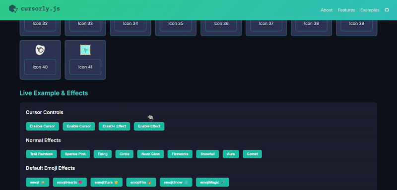

# Cursorly.js

**Cursorly.js** is a lightweight, customizable JavaScript library for creating **custom mouse cursors with optional particle effects**. It supports multiple cursor icons, dynamic effects, and easy integration with any web project.



---

## **Features**

- Custom cursor icons with multiple choices.
- Optional particle effects (`trail`, `sparkle`, or `none`).
- Optional Emoji effects (Both default and customizable).
- Fully configurable particle options: `density`, `size`, `decay`, `hueStep`.
- Enable/disable cursor and particle effects dynamically.
- Fullscreen, high-performance canvas that doesn’t interfere with page interactions.
- Easy initialization with minimal code.

---
### **Browser Support**
---
Cursorly.js works in all modern browsers (Chrome, Firefox, Safari, Edge).

## **Installation**

Include via **CDN**:

```html
<script src="https://cdn.jsdelivr.net/gh/iamashruu/cursorly.js@v1.0.1/dist/cursorly.min.js"></script>
```


## **Basic Usage**

Initialize the cursor with default options:

```javascript
const cursor = Cursorly.init();
```
OR, Initialize with custom icon and effect:

```javascript
const cursor = Cursorly.init({
    cursor: 0, // Index of the cursor icon (default: 0)
    effect: { name: "trail", color: "rainbow" } // Effect name and color are required
});
```
OR, Initialize with custom icon and emoji effect
```
const cursor = Cursorly.init({
    cursor: 0,
    effect: { name: "emoji", shape:"👻"}
});
```

### **Cursor Icons**
---
Cursorly supports multiple icons. Change icon dynamically:

```javascript
cursor.setIcon(1); // Change to icon index 1 
```

### **Default Effects**
---
Effect options (only name and color are required):

```javascript
cursor.setEffect({
    name: "sparkle",   // 'trail', 'sparkle', or 'emojiSnow',etc
    color: "#ff4081",  // Hex color or "rainbow"
    density: 10,       // Optional, number of particles per mouse move
    size: [3, 12],     // Optional, min and max particle size
    decay: 0.92,       // Optional, particle shrink rate
});
```
### **Custom Emoji Effects**
---
Effect options (only name and shape are required):

```javascript
cursor.setEffect({
    name: "emoji",   // required, use 'emoji' always for custom emoji effect
    shape: "👻",     // required, put desired emoji
    density: 10,       // Optional, number of particles per mouse move
    size: [3, 12],     // Optional, min and max particle size
    decay: 0.92,       // Optional, particle shrink rate
});
```
Disable or enable effects dynamically::
```javascript
cursor.disableEffect(); // Turn off particle effects
cursor.enableEffect();  // Turn on particle effects
```
---
### **Enable/Disable Cursor**
---
Cursorly supports multiple icons. Change icon dynamically:

```javascript
cursor.disable(); // Hide custom cursor, revert to default
cursor.enable();  // Show custom cursor again
```

## **Contributing**

We welcome contributions from the community!

